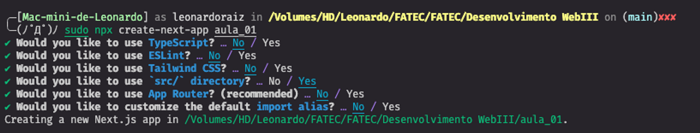

# Aula 01

## REACT e NEXT

React e Next.js são duas tecnologias amplamente utilizadas no desenvolvimento web moderno. React é uma biblioteca JavaScript de código aberto criada pelo Facebook, projetada para criar interfaces de usuário interativas e reativas. Por outro lado, o Next.js é um framework de React que oferece uma camada adicional de funcionalidades e facilidades para o desenvolvimento de aplicativos web, especialmente voltados para o servidor.

O React revolucionou a forma como os desenvolvedores constroem interfaces de usuário, permitindo a criação de componentes reutilizáveis que facilitam a construção de interfaces complexas. Sua abordagem baseada em componentes oferece um fluxo de desenvolvimento mais estruturado e uma melhor organização do código. Além disso, a sua natureza reativa permite que as alterações nos dados sejam refletidas automaticamente na interface, sem a necessidade de manipulações manuais do DOM.

O Next.js, por sua vez, constrói sobre o React, adicionando funcionalidades voltadas para a construção de aplicativos web do lado do servidor. Ele oferece renderização do lado do servidor (SSR) e renderização do lado do cliente (CSR), permitindo que os desenvolvedores escolham a melhor abordagem para seus projetos específicos. Essa flexibilidade é extremamente útil para melhorar a experiência do usuário, a otimização para mecanismos de busca (SEO) e o desempenho geral do aplicativo.

Uma das grandes vantagens do Next.js é a sua configuração mínima e sua fácil integração com projetos existentes baseados em React. Além disso, o Next.js também fornece roteamento simples e eficiente, o que facilita a navegação entre as diferentes páginas do aplicativo. Isso é particularmente útil em aplicações maiores, onde a estrutura organizada é fundamental para a manutenção do código.

Outro recurso poderoso do Next.js é a geração de páginas estáticas e pré-renderizadas. Com o Next.js, é possível gerar páginas estáticas no momento da compilação, o que acelera o tempo de carregamento do aplicativo e melhora o SEO. Além disso, ele também suporta a geração de páginas pré-renderizadas sob demanda, permitindo que partes específicas do aplicativo sejam renderizadas do lado do servidor conforme necessário.

O ecossistema em torno do Next.js é robusto, com suporte ativo da comunidade e uma ampla variedade de plugins e módulos adicionais que estendem ainda mais suas capacidades. Além disso, muitas empresas adotaram o Next.js como a base para seus projetos, tornando-o uma escolha sólida para projetos de todos os tamanhos.

Em resumo, React e Next.js são tecnologias poderosas para o desenvolvimento web moderno. O React oferece uma abordagem reativa e baseada em componentes para a construção de interfaces de usuário, enquanto o Next.js adiciona recursos avançados, como renderização do lado do servidor e geração de páginas estáticas, tornando-se uma escolha excelente para projetos ambiciosos e de alto desempenho. Juntos, eles formam uma combinação poderosa para os desenvolvedores que desejam criar aplicativos web avançados e responsivos.

## Criação do primeiro projeto REACT/NEXT.js

### Criando o projeto

Para criar o nosso projeto, vamos utilizar o comando abaixo no terminal:

```jsx
npx create-next-app aula_01
```

Esse comando criará um novo aplicativo chamado "aula_01" usando o framework Next.js. Ele vai configurar a estrutura inicial do projeto para nós.



### Entendendo a estrutura inicial

Após a criação do componente, acesse o diretório usando o comando:

```jsx
cd Aula_01
```

Neste projeto, já temos uma estrutura básica, com uma pasta "pages" onde criaremos nossos componentes.

### Primeiro componente

Vamos começar criando nosso primeiro componente chamado "primeiroComp.js" na pasta "pages":

```jsx
// pages/primeiroComp.js

export default function primeiroComp() {
    return "Primeiro componente";
}
```

Neste código, criamos um componente simples que retorna uma string "Primeiro componente".

### Segundo componente com JSX

Agora, vamos criar um segundo componente chamado "segundoComp.js" usando JSX:

```jsx
// pages/segundoComp.js

export default function segundoComp(){
    return "<h1> Segundo </h1>";
}
```

Neste código, temos um componente que retorna uma string contendo uma tag HTML em formato de texto. Notem que não estamos usando JSX aqui.

Segundo componente com JSX compilado

Agora, vamos criar uma variação do segundo componente, utilizando JSX e retornando uma tag HTML diretamente:

```jsx
// pages/segundoComp.js

export default function segundoComp(){
    return <h1> Segundo </h1>;
}
```

Aqui, temos um componente que retorna a tag `<h1>` usando JSX. O JSX permite escrever código HTML diretamente dentro do JavaScript.

### Trabalhando com JSX

Agora que entendemos os conceitos básicos de componentes e JSX, vamos criar mais alguns exemplos para fixar o aprendizado.

Vamos começar criando um novo componente chamado "jsx1.js":

```jsx
// pages/jsx1.js

export default function jsx1() {
    const valor = (
        <div>
            <h1>JSX #01</h1>
            <p>Teste de duas tags</p>
        </div>
    );
    return valor;
}
```

Neste código, estamos criando um componente que retorna múltiplas tags HTML utilizando JSX.

### Utilizando expressões em JSX

Agora, vamos criar outro componente chamado "jsx2.jsx" para demonstrar o uso de expressões em JSX:

```jsx
// pages/jsx2.jsx

export default function jsx2(){
    const subtitulo = "Estou aprendendo REACT";
    const valorH3 = <h3>{5 * 5}</h3>;

    return (
        <div>
            <h1>Integração JS e JSX</h1>
            <h2>{subtitulo}</h2>
            {valorH3}
            <h4>{Math.max(1, 100)}</h4>
            <h5>{entre(9.6, 1, 10)}</h5>
        </div>
    );
}

function entre(valor, min, max) {
    if (valor >= min && valor <= max) {
        return "Sim";
    } else {
        return "Não";
    }
}
```

Neste código, criamos um componente que utiliza expressões em JSX para realizar cálculos e exibir informações no DOM.

### Desafio!

Agora, para o desafio, sua tarefa é criar um novo componente que renderize 10 itens no DOM. Você pode usar loops ou arrays para criar esses itens e exibi-los na página. Lembre-se de usar a estrutura de pastas e o padrão de nomenclatura corretos para criar o componente na pasta "pages".

Essa é uma ótima oportunidade para praticar o que aprendemos até agora. Boa sorte! E lembre-se de sempre que precisar, pode recorrer ao código acima como referência. Bons estudos!
